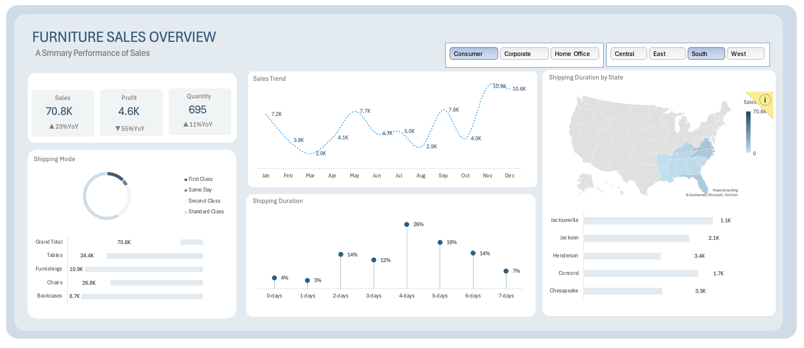

# furniture-sales-dashboard(interesting dashboard creation using MS excel)
## Project overview
This project explores four years of furniture retail order data to understand what's driving sales, profit, and quantity trends. While overall sales grew 23% year-over-year, profit fell 55% — this dashboard and analysis dig into why, surfacing key drivers like heavy losses on Tables and negative profitability in the Central region despite healthy revenue in both.
## Dataset used
- <a href="https://github.com/Dhrubadutta451/furniture-sales-dashboard/blob/main/2026-03-08T18-27-20.166Z-Dashbaord.xlsx">Dataset<a/>
# Furniture Sales Dashboard

An interactive Excel dashboard analyzing furniture retail performance from 2014 to 2017, built to surface actionable insights into sales growth, profitability, and regional performance across a 2,100+ order dataset.



## Overview

This project analyzes four years of furniture retail transaction data to evaluate business performance across customer segments, regions, product sub-categories, and shipping operations. The dashboard combines KPI summaries, trend analysis, and interactive filtering to answer a central business question:

> **Sales grew 23% year-over-year — so why did profit decline by 55%?**

The analysis identifies the specific product lines and regions responsible for the profitability gap, providing a data-driven foundation for pricing, discounting, and operational decisions.

## Key Findings

| Metric | Value |
|---|---|
| Total Sales | $70,806 (▲23% YoY) |
| Total Profit | $4,619 (▼55% YoY) |
| Units Sold | 695 (▲11% YoY) |

**Profitability drivers:**
- **Tables** generated $206,967 in sales but a net loss of **-$17,733** — the largest contributor to declining profitability
- **Bookcases** also operated at a loss (**-$3,479**) despite $114,879 in sales
- **Chairs** were the strongest performer, contributing $26,586 in profit
- The **Central region** posted an overall loss (**-$2,867**), while all other regions remained profitable
- The **West region** delivered the highest returns, with $11,496 in profit on $252,619 in sales

**Segment and seasonality patterns:**
- The **Consumer segment** accounted for the highest sales volume, while the **Corporate segment** delivered stronger profit efficiency per order
- **Q4 (September–December)** generated nearly half of annual revenue, indicating strong seasonal demand

## Dataset Structure

The workbook is organized into three sheets:

| Sheet | Description |
|---|---|
| `Furniture_Sales` | Order-level transactional data (2,121 records), including order date, customer segment, region, product category, sales, quantity, discount, and profit |
| `Calculations` | Aggregated KPIs, year-over-year comparisons, and supporting pivot tables |
| `Dashboard` | Interactive dashboard with filterable charts covering sales trends, shipping duration, regional distribution, and category performance |

## Tools & Methods

- **Microsoft Excel** — Pivot Tables, calculated fields, interactive slicers, and chart-based visualizations
- **Data period:** 2014–2017 furniture order transactions

## Usage

1. Download the Excel workbook from this repository
2. Open it in Microsoft Excel
3. Use the **Segment** and **Region** slicers on the Dashboard sheet to filter results and explore performance by customer type and geography

## Repository Structure

```
├── dashboard-screenshot.png     # Static preview of the dashboard
├── Furniture-Sales-Dashboard.xlsx
├── README.md
├── LICENSE
└── .gitignore
```

## License

This project is licensed under the MIT License. See the [LICENSE](LICENSE) file for details.

